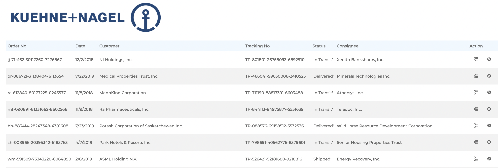
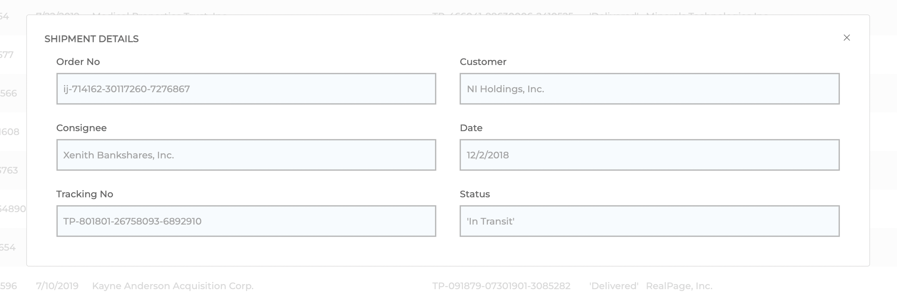

# FRONT-END INTERNSHIP TEST TASK

## Task description

_Task:_

- Create shipments CRUD page;
- Should load data from provided API;
- If API is not available - should use local file;
- Data should be displayed in generated table
- Table rows should have **details** and **delete** buttons
- Click on **details** should open panel with details
- Editing details in panel should update an entry
- Click on **delete** should delete an entry

## Solution

This project was created with **React.js** using following libraries:

- axios;
- react-modal;
- react-router;
- react-icons.

**_Shipments table_**

**_Shipment details panel_**

## Improvements

_To do list for project improvement:_

- add columns sorting;
- use portals to render modal window as a separate element, not as an element of the main body;
- consider using style template from [Creative Tim](https://www.creative-tim.com/);
- consider using [MUI table](https://mui.com/material-ui/react-table/) or [Bootstrap](https://getbootstrap.com/) ;
- add tests.
